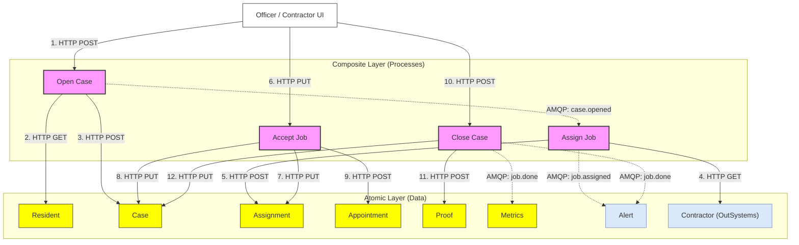

# 🏗️ System Architecture

## 💡 Core Setup Breakdown

## Core Philosophy: Atomic & Composite

TownOps is built around the **Atomic/Composite** microservices pattern, designed to achieve clean separation of concerns and maintainable data ownership.

### 1. ⚛️ Atomic Services (Atoms)

- **Role**: Domain Data Owners.
- **Tech**: Bun + Hono
- **Rules**:
  - Each atom owns exactly one database table (or a set of related tables).
  - Atoms **never** call other atoms via HTTP.
  - Atoms are agnostic of the business processes they belong to.

### 2. 🔗 Composite Services (Composites)

- **Role**: Business Logic Orchestrators.
- **Tech**: Bun + Hono
- **Rules**:
  - Composites do not have their own persistent storage.
  - They coordinate multiple atoms using HTTP REST calls.
  - They are responsible for workflow execution and state coordination.
  - They emit process-driven events (e.g., `case.opened`) to coordinate downstream workflows asynchronously.

### 3. 📨 Messaging Layer (AMQP)

- **Broker**: RabbitMQ.
- **Patterns**:
  - **Process Choreography**: Composites publish process states (e.g., `case.opened`, `job.assigned`).
  - **SLA Monitors (DLX)**: Delayed queues with TTL that route to a Dead Letter Exchange on expiration (triggers `sla.breached`).
  - **Audit & Analytics**: Consumer queues for `Metrics` and `Alert` tracking.

## Data Flow Illustration (Ideal Case Creation)

## 🔐 Authentication & Identity

Authentication is handled by the **Auth atom** (`better-auth` with JWT plugin, port 5008).

- Users sign in via `POST /api/auth/sign-in/email` and receive a session cookie.
- A signed RS256 JWT is obtained via `GET /api/auth/token` and stored client-side.
- Frontend-facing composites and atoms validate the JWT via the JWKS endpoint (`GET /api/auth/jwks`).
- **Service-to-service calls** (e.g., from AMQP consumers) carry no user JWT — JWK middleware must not be applied to routes called exclusively by internal consumers.

### Contractor Identity

Contractor accounts in the auth atom are linked to their OutSystems UUID via a `contractor_id` additional field. At sign-up, the OutSystems UUID is stored in this field. When the contractor frontend needs to perform role-specific operations (e.g., filtering assignments), it reads `contractorId` from the session via `auth.getSession()` — not from the JWT `sub` claim, which is the better-auth internal user ID.

## ↔️ Scaling Strategy

- **Horizontal Scaling**: Each service is containerised (Docker) and can be scaled independently based on workload.
- **Scale-to-Zero**: Infrastructure supports scale-to-zero configurations (e.g., Azure Container Apps) for cost-efficient operations.
