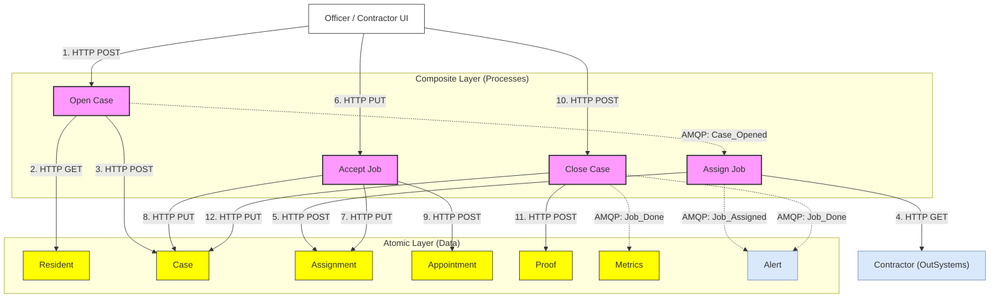

# System Architecture

## Core Philosophy: Atomic & Composite

TownOps is built around the **Atomic/Composite** microservices pattern, designed to achieve clean separation of concerns and maintainable data ownership.

### 1. Atomic Services (Atoms)

- **Role**: Domain Data Owners.
- **Tech**: Bun + Hono
- **Rules**:
  - Each atom owns exactly one database table (or a set of related tables).
  - Atoms **never** call other atoms via HTTP.
  - Atoms are agnostic of the business processes they belong to.

### 2. Composite Services (Composites)

- **Role**: Business Logic Orchestrators.
- **Tech**: Python + FastAPI
- **Rules**:
  - Composites do not have their own persistent storage.
  - They coordinate multiple atoms using HTTP REST calls.
  - They are responsible for workflow execution and state coordination.
  - They emit process-driven events (e.g., `Case_Opened`) to coordinate downstream workflows asynchronously.

### 3. Messaging Layer (AMQP)

- **Broker**: RabbitMQ.
- **Patterns**:
  - **Process Choreography**: Composites publish process states (e.g., `Case_Opened`, `Job_Assigned`).
  - **SLA Monitors (DLX)**: Delayed queues with TTL that route to a Dead Letter Exchange on expiration (e.g., triggers `SLA_Breached`).
  - **Audit & Analytics**: Consumer queues for `Metrics` and `Alert` tracking.

## Data Flow Illustration (Ideal Case Creation)

## Scaling Strategy

- **Horizontal Scaling**: Each service is containerized (Docker) and can be scaled independently based on workload.
- **Scale-to-Zero**: Infrastructure supports scale-to-zero configurations (e.g., Azure Container Apps) for cost-efficient operations.
