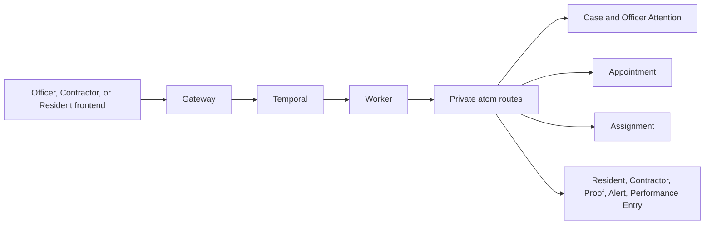

# System architecture

TownOps keeps domain data in atoms and orchestrates every Case lifecycle in
Temporal. `docker-compose.yml` is authoritative for deployed services and
ports; [ADR 0001](./adr/0001-temporal-orchestration.md) records the boundary.

## Boundaries

- **Atoms** own persistence and domain state. They never orchestrate a Case or
  call another atom.
- **Gateway** is the only browser-facing API. It proxies public `/api/auth/*`,
  validates Case-route JWTs, and starts or signals Workflows.
- **Worker** runs Temporal Workflows and Activities. It coordinates private
  atom routes with `WORKER_SERVICE_TOKEN`.
- **Frontends** are role-specific React applications configured with the
  Gateway URL; they do not call atom URLs.

## Case path

```mermaid
flowchart LR
    UI[Officer, Contractor, or Resident frontend] --> Gateway[Gateway]
    Gateway --> Temporal[Temporal]
    Temporal --> Worker[Worker]
    Worker --> Atoms[Private atom routes]
    Atoms --> Case[Case and Officer Attention]
    Atoms --> Appointment[Appointment]
    Atoms --> Assignment[Assignment]
    Atoms --> Other[Resident, Contractor, Proof, Alert, Performance Entry]
```

The Worker performs forward recovery. Acceptance temporarily holds an
Appointment slot; a permanent acceptance failure releases only that hold.
Other committed Case transitions are preserved and surfaced for recovery.

## Authentication and internal calls

The Gateway exposes the Auth atom only through public `/api/auth/*`. It
validates JWTs for Case routes using the Auth JWKS endpoint. Atom internal
routes require `WORKER_SERVICE_TOKEN`, never a browser JWT.
