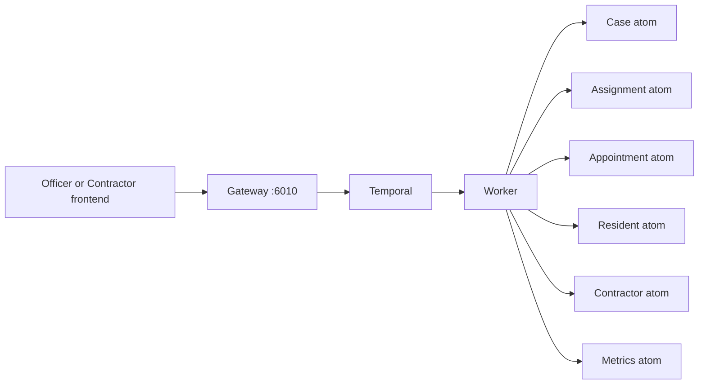

# System architecture

TownOps keeps domain data in atoms and runs the current Case orchestration in
Temporal. `docker-compose.yml` is authoritative for deployed services and
ports.

## Boundaries

- **Atoms** own their persistence and expose domain HTTP APIs. They do not
  orchestrate workflows or call other atoms.
- **Gateway** is the browser-facing HTTP boundary. It validates user identity,
  starts or signals Temporal Workflows, and returns typed workflow results.
- **Worker** runs the Workflows and Activities. It coordinates atoms over HTTP
  using its service token on internal routes.
- **Composites** remain stateless HTTP/AMQP orchestrators for existing flows.
  They do not own persistence.
- **Frontends** are role-specific React applications. New Case-orchestration
  mutations use the Gateway instead of directly orchestrating atoms.

## Current Case path

```mermaid
flowchart LR
    UI[Officer or Contractor frontend] --> Gateway[Gateway :6010]
    Gateway --> Temporal[Temporal]
    Temporal --> Worker[Worker]
    Worker --> Case[Case atom]
    Worker --> Assignment[Assignment atom]
    Worker --> Appointment[Appointment atom]
    Worker --> Resident[Resident atom]
    Worker --> Contractor[Contractor atom]
    Worker --> Metrics[Metrics atom]
```

The implemented Workflow Updates are `openCase`, `allocateContractor`, and
`acceptAllocation`. Acceptance reserves an internal Appointment slot, accepts
the current Allocation Attempt, then confirms the public Appointment. A
permanent acceptance failure compensates by releasing the held slot.

RabbitMQ remains available to the existing composite and notification flows;
it is not the authority for the Temporal Case path above.

## Authentication and internal calls

The Auth atom is on port 5001. Browser-facing Gateway routes validate the JWT
through its JWKS endpoint. Internal routes invoked by the Worker use
`WORKER_SERVICE_TOKEN`; do not attach user-JWT middleware to those routes.

Contractor accounts resolve to a Contractor identity before a Contractor can
accept an Allocation Attempt. The Gateway passes that identity to the
Workflow, which verifies that it owns the current pending Attempt.
