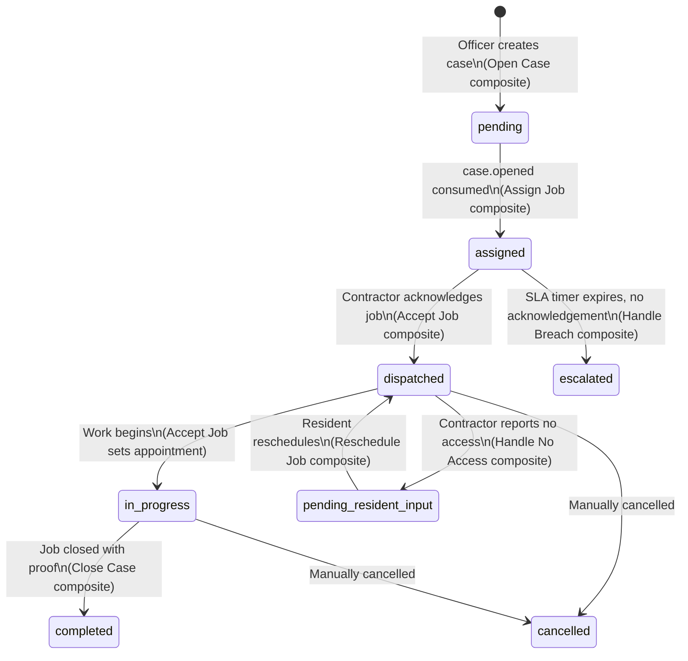

# 🔄 Case Lifecycle

## Case Status State Machine

## Status Definitions

| Status                   | Description                                                    | Set By                                                 |
| :----------------------- | :------------------------------------------------------------- | :----------------------------------------------------- |
| `pending`                | Case created, awaiting contractor assignment                   | Open Case composite                                    |
| `assigned`               | Contractor selected and assignment record created              | Assign Job composite (via `case.opened` event)         |
| `dispatched`             | Contractor has acknowledged and accepted the job               | Accept Job composite                                   |
| `in_progress`            | Work is underway; appointment block created                    | Accept Job composite                                   |
| `pending_resident_input` | Contractor could not access site; awaiting resident reschedule | Handle No Access composite _(Scenario 3)_              |
| `completed`              | Job closed with proof submitted                                | Close Case composite                                   |
| `escalated`              | SLA breached; reassigned to backup contractor                  | Handle Breach composite (via `sla.breached` DLX event) |
| `cancelled`              | Case manually cancelled                                        | Direct API call                                        |

## Assignment Status State Machine

Each case has a corresponding **Assignment** record that tracks the contractor relationship separately.

| Status               | Description                                             |
| :------------------- | :------------------------------------------------------ |
| `PENDING_ACCEPTANCE` | Assignment created; awaiting contractor acknowledgement |
| `ACCEPTED`           | Contractor acknowledged within SLA window               |
| `BREACHED`           | SLA window expired before acknowledgement               |
| `REASSIGNED`         | Replaced by a new assignment after breach               |
| `COMPLETED`          | Job closed successfully                                 |
| `CANCELLED`          | Assignment voided                                       |

Assignment source is also tracked:

| Source            | Description                                                                 |
| :---------------- | :-------------------------------------------------------------------------- |
| `AUTO_ASSIGN`     | Selected automatically by Assign Job composite (fewest jobs, highest score) |
| `MANUAL_ASSIGN`   | Officer manually assigned                                                   |
| `BREACH_REASSIGN` | Reassigned by Handle Breach composite after SLA expiry                      |

## SLA Window

The SLA timer starts when the assignment is created (`responseDueAt` = `assignedAt + 5 minutes`). For demo purposes, the DLX TTL is set to **15 seconds**.

If the contractor does not call `PUT /api/jobs/accept-job` before `responseDueAt`:

1. The DLX dead-letters the SLA timer message to `handle-breach-queue`
2. Handle Breach composite escalates the case and reassigns to a backup contractor
3. A new `PENDING_ACCEPTANCE` assignment is created with a fresh SLA window
4. A penalty is recorded in the Metrics atom (`scoreDelta: -10, reason: "SLA_BREACH_NO_ACKNOWLEDGEMENT"`)

## Proof & Closure

When a contractor closes a job via the **Close Job** sheet:

1. Before/after photos are uploaded to Supabase Storage via `POST /api/proof` (multipart)
2. All proof items are batch-saved via `POST /api/proof/batch`
3. Case status is set to `completed`
4. `job.done` event is published — consumed by Metrics and Alert atoms

Proof item types: `before`, `after`, `signature`.
