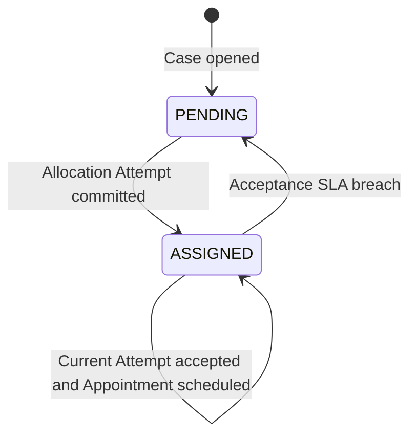

# Case lifecycle

This document describes the implemented Temporal Case path through PRS-144.
Future lifecycle work remains specified in the Temporal orchestration plan.

## Implemented path

```mermaid
stateDiagram-v2
    [*] --> PENDING : Case opened
    PENDING --> ASSIGNED : Allocation Attempt committed
    ASSIGNED --> ASSIGNED : Current Attempt accepted and Appointment scheduled
    ASSIGNED --> PENDING : Acceptance SLA breach
```

Case status remains `ASSIGNED` after an Allocation Attempt is accepted. Work
start, No Access, rescheduling, and completion are separate follow-up
behaviours; acceptance does not start work.

An Attempt that is not accepted before its Acceptance SLA deadline breaches:
the Case returns to `PENDING`, one unresolved Officer Attention item is raised,
and a replacement Attempt is appended to the same Assignment. That attention
resolves when the replacement Attempt is accepted, or when the Case goes
terminal.

## Case statuses

| Status                   | Meaning on the Temporal path                                                   |
| :----------------------- | :----------------------------------------------------------------------------- |
| `PENDING`                | Case exists with no pending or accepted Allocation Attempt                     |
| `ASSIGNED`               | A Contractor is allocated; it remains this status after appointment scheduling |
| `IN_PROGRESS`            | Reserved for explicit work start                                               |
| `PENDING_RESIDENT_INPUT` | Reserved for recovery such as No Access                                        |
| `COMPLETED`              | Terminal Case state                                                            |
| `CANCELLED`              | Terminal Case state                                                            |

## Assignment and Allocation Attempts

Each Case has one stable Assignment. Reallocation appends an Allocation Attempt
instead of replacing that Assignment.

| Allocation Attempt status | Meaning                                                                |
| :------------------------ | :--------------------------------------------------------------------- |
| `PENDING_ACCEPTANCE`      | The linked Contractor may accept it before its Acceptance SLA deadline |
| `ACCEPTED`                | The Contractor accepted and one Appointment was scheduled              |
| `BREACHED`                | The Acceptance SLA elapsed without acceptance                          |
| `WITHDRAWN`               | A replacement allocation withdrew the pending offer                    |

## Appointment scheduling

The Appointment atom owns the public `SCHEDULED` Appointment and its internal
slot claim. A claim passes from `HELD` to `ACTIVE` when confirmation succeeds,
or to `RELEASED` when a permanent acceptance failure is compensated. PostgreSQL
prevents overlapping active intervals for one Contractor.
