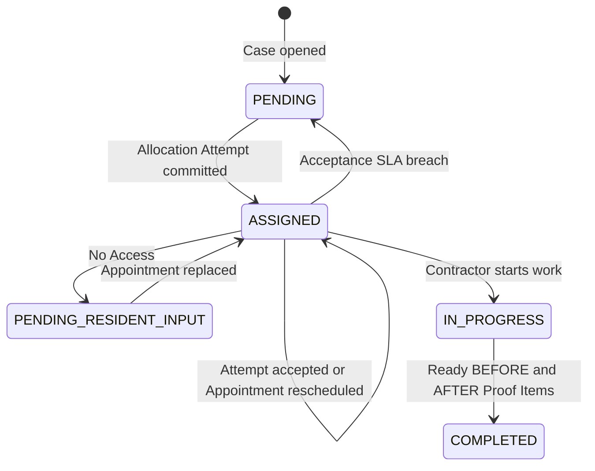

# Case lifecycle

The Temporal Case Workflow owns allocation, attendance, recovery, completion,
and their durable timers.

```mermaid
stateDiagram-v2
    [*] --> PENDING : Case opened
    PENDING --> ASSIGNED : Allocation Attempt committed
    ASSIGNED --> ASSIGNED : Attempt accepted or Appointment rescheduled
    ASSIGNED --> PENDING : Acceptance SLA breach
    ASSIGNED --> PENDING_RESIDENT_INPUT : No Access
    PENDING_RESIDENT_INPUT --> ASSIGNED : Appointment replaced
    ASSIGNED --> IN_PROGRESS : Contractor starts work
    IN_PROGRESS --> COMPLETED : Ready BEFORE and AFTER Proof Items
```

Acceptance schedules an Appointment but leaves the Case `ASSIGNED`. The
Workflow records each later transition; atoms remain the source of the
corresponding domain state.

## Missed Appointments and recovery

The Workflow tracks every `SCHEDULED` Appointment to its end time. An
unattended Appointment becomes `MISSED` at that time and raises one
`MISSED_APPOINTMENT` Officer Attention item. It does not change the Case or
Assignment, penalise a Contractor, or reallocate work.

An Officer or Resident recovers the visit through Reschedule. The old
Appointment remains `MISSED`, a new `SCHEDULED` Appointment is created, and
the Officer Attention resolves.

## Completion

Completion requires ready `BEFORE` and `AFTER` Proof Items for the active Case
and Contractor. The Workflow advances Appointment, Assignment, and Case to
`COMPLETED`, then records one idempotent `+10` Performance Entry. A committed
transition is not rolled back; an exception raises Officer Attention for
recovery.

## Case statuses

| Status                   | Meaning on the Temporal path                                      |
| :----------------------- | :---------------------------------------------------------------- |
| `PENDING`                | Case exists with no pending or accepted Allocation Attempt        |
| `ASSIGNED`               | A Contractor is allocated, including after Appointment scheduling |
| `IN_PROGRESS`            | Contractor has explicitly started work                            |
| `PENDING_RESIDENT_INPUT` | Case needs Resident input after a recovery event                  |
| `COMPLETED`              | Terminal Case state                                               |
| `CANCELLED`              | Terminal Case state                                               |

## Assignment and Allocation Attempts

Each Case has one stable Assignment. Reallocation appends an Allocation Attempt
rather than replacing its Assignment.

| Allocation Attempt status | Meaning                                                         |
| :------------------------ | :-------------------------------------------------------------- |
| `PENDING_ACCEPTANCE`      | Linked Contractor may accept before its Acceptance SLA deadline |
| `ACCEPTED`                | Contractor accepted and an Appointment was scheduled            |
| `BREACHED`                | Acceptance SLA expired                                          |
| `WITHDRAWN`               | Replacement allocation withdrew the pending offer               |
